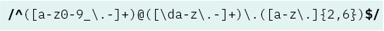
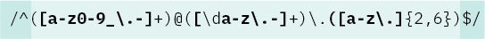
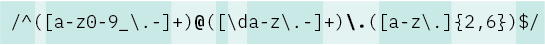
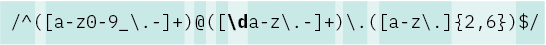
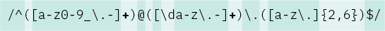
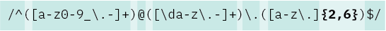

# Regex for Validating an Email Address

If you have had to create a user sign up or sign in for a web site, you have almost certainly had to collect a user's email address, amongst other data, to create a newthe profile or search for an existing one. The developer is presented with two choices: validate that the provided email address is a valid email address in terms of matching the expected structure, or let it fly and hope that the user doesn't have a mistake in their email input. It's extremely important that the email address be correct-- it may be necessary to send a verification email to complete account set up or the email address itself may be used as the user name. Validating the email address seems like the wise choice for the developer, but how do you actually do this? With regex! Don't understand regex? Never fear; You'll learn the search pattern for an email address in this tutorial, and what that seemingly random string of characters actually means. Once you begin to understand the power of regex, you'll find more uses for it than you had ever imagined.

## Summary

Let's begin by looking at the email search pattern and then break it down into its constiuent parts.

`/^([a-z0-9_\.-]+)@([\da-z\.-]+)\.([a-z\.]{2,6})$/`

**Stop!** Don't *just* copy this and paste it into your own code and leave! **Stick around for the explanation**. I promise that learning regex is worth the modest time investment. Once you understand the power of searching and matching patterns, you'll be wondering where regex has been all your life!

## Table of Contents

- [What is Regex, anyway?](#what-is-regex)
- [Anchors](#anchors)
- [Quantifiers](#quantifiers)
- [OR Operator](#or-operator)
- [Character Classes](#character-classes)
- [Flags](#flags)
- [Grouping and Capturing](#grouping-and-capturing)
- [Bracket Expressions](#bracket-expressions)
- [Greedy and Lazy Match](#greedy-and-lazy-match)
- [Boundaries](#boundaries)
- [Back-references](#back-references)
- [Look-ahead and Look-behind](#look-ahead-and-look-behind)

## What is Regex, anyway?

Regex is short for "regular expressions". You would think that, based on its derivation, Regex would be pronounced Reg like "beg". That would make sense. But no, it is in fact pronounced reg like "hedge". Or "ledge".

A regular expression defines a pattern that is used to match strings of text. It can be used for user input validation, cleaning up copy provided by a third party, or for your own find/replace needs when writing your own code during development. Regex may consist of a combination of literal characters (the character taken literally, such as the )

Learning how to mentally parse a regular expression is a bit like learning a language. It may seem foreign and unintelligible at first, but when you start to understand its components, that random-looking string of characters won't seem so random looking anymore.

## Regex Components

### Anchors

Let's begin our exploration of the regex matching an email address by looking at the very beginning and the very ending. You will see a forward slash, caret at the beginning and a dollar sign, forward slash at the end. The forward slashes are like a wrapper that contains the regex pattern. **The `^` is an anchor** which signifies the start of a string of characters, in the same way that you could think of quotation marks signifying the start of a quote, citation, or spoken text. **The `$` is also an anchor** and it signifies a string that begins with the characters that precede it. The string match could be an exact string match (literal) which must include all of the characters listed in the precise order they are listed. Alternatively, the match could be a **bracket expression** which defines a set of possible matches. The anchors you see here could be used in conjunction with exact matches and/or a set of possible matches.

### Bracket Expressions

Anything inside a set of square brackets represents one or more characters to be matched, and this is called a **bracket expression** or a **positive character group**. The characters don't need to be matched in the order shown, nor do they even all have to be matched. The match must have *at least one* of the characters within the bracket expression. This behavior is similar to that of the logical OR operator (||).

Looking at our email regex example, let's consider the first set of characters in brackets: `[a-z0-9_\.-]`. What characters are we looking for? The letters a through z (inclusive), digits 0 through 9 (inclusive), and the "special characters" underscore, backslash, period, and hyphen. That's quite a few possibilities which makes sense because of the huge variety of email users that can exist.

As you can see, there are two other groups of bracket expressions in the pattern as well. Skipping the second bracket expression for the time being and looking at the third, we see that the pattern to match is not as broad as the first. We have the letters a through z (inclusive), backslash, and period. This bracket expression doesn't include any digits, underscores or hyphens.

### Character Escapes for Literals

Within a bracket expression, all characters are interpreted literally. The power of regex comes from its ability to indicate certain types of characters and groupings using wildcards and other methods. When it comes to literals, well... as the saying goes "a cigar is sometimes just a cigar" and so it is with literals. If you have ever had to escape text within single quotes that includes a conjunction (such as 'wasn't') where the apostrophe would have otherwise indicated the end of the string, you have used a back slash ('\') so the apostrophe is interpreted as an apostrophe and not a range indicator. The back slash serves as an "escape".

In regex, a period that isn't inside of a bracket expression isn't a literal (stay tuned to find out what it does mean!) so the bolded code shown above `\.` is an example of a back slash being used for escape purposes. The period is relieved of its usual regex responsibilities and gets to be an actual period for a change. You might have some recognition about the usage here. Appearing near the end of our regex pattern, a literal period also appears near the end of an email address... .com, .gov, .org, and .edu are some common examples.

### Character Classes

Now, let's take a look at character classes. Character classes are a shorthand of sorts and allow reference to certain types or collections of characters without having to list each possible character explicitly in a bracket expression. One example includes our recently discussed friend, the period. In regex, `.` matches any character except the newline character. That's a lot of characters! Without this shorthand character class, we would have to list each character explicitly (or as a range of characters) and that could make for an unwieldy bracket expression.

Other character classes include `\s` that matches whitespace characters (in this case including tabs and line breaks) and its companion, `\S` that matches only NON-whitespace characters. `\w` matches any alphanumeric character, including an underscore. `\W` matches non-alphanumeric characters. `\d` matches any numerical digit, and, as you probably anticipated, `\D` matches non-numerical digits. And oh look, speaking of numerical digits, we see `\d` in our email regex pattern. This indicates that the second bracket expression can contain any digit and is equivalent to `[0-9]`.

### Quantifiers

Quantifiers refers here not to the values of integers or floats, or even matching a specific digit, but to how many times a pattern may (or must) exist to be matched... the quantity of patterns. This could be exact number (we can call it 'n') of times, depicted by `{ n }`, as in the pattern must appear exactly five times, or `{ 5 }`. `{ n, }` indicates a match of *at least* n times, and ` { n, x }` matches a minimum of n times and a maximum of x times.

There are some frequently used quantifiers that can't be indicated using the curly braces we just discussed. `*` (zero or more times, aka "it might appear multiple times or it might not appear at all"), `+` (one or more times, aka "it must appear at least once but could appear more than once"), and `?` (zero or one time, aka "It might not appear but if it does, it must only appear once").

Bringing this concept of quantifiers back to our email pattern example, let's take a look at that pattern. Do you see any quantifiers?

Yes! We have two instances of `+` and we now know that this means that the bracket expressions we have already looked at must appear at least once. One way to look at this is to say that a valid email address must begin with a string of one or more of the matching characters within the brackets, and the same with the second bracketed grouping of characters which is similar but not exactly the same.

Any other quantifiers? Why, yes! 

The third bracket expression is immediately followed by `{2, 6}`. We now know that the 2 is the minimum number of times it can exist and 6 is the maximum number of times it can exist. In more common parlance, we would say that the string must be 2 to 6 characters.

### Grouping and Capturing

### OR Operator

### Flags

### Greedy and Lazy Match

### Boundaries

### Back-references

### Look-ahead and Look-behind

## Author

I am a graphic designer and web development student who has actually been using regex for several years but under the name GREP. Adobe InDesign has a search function that allows you to search your document's text for regex patterns for find/replace operations as well as for conditional styling.
